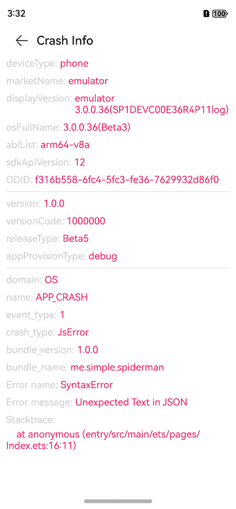

# SpiderManHarmony

🔥🔥🔥 - 崩溃日志手机端显示 ，测试妹妹的最爱，开发哥哥的小棉袄。

## 如何安装

```shell
ohpm install spider-man
```

## 如何使用

在EntryAbility的`onWindowStageCreate`初始化`SpiderMan`，最好加`isDebug`判断，只在调试环境显示崩溃信息。

```typescript
if (isDebug) {
  SpiderMan.init();
}
```

然后当异常发生，再次启动App的时候，就会显示崩溃信息页面。

